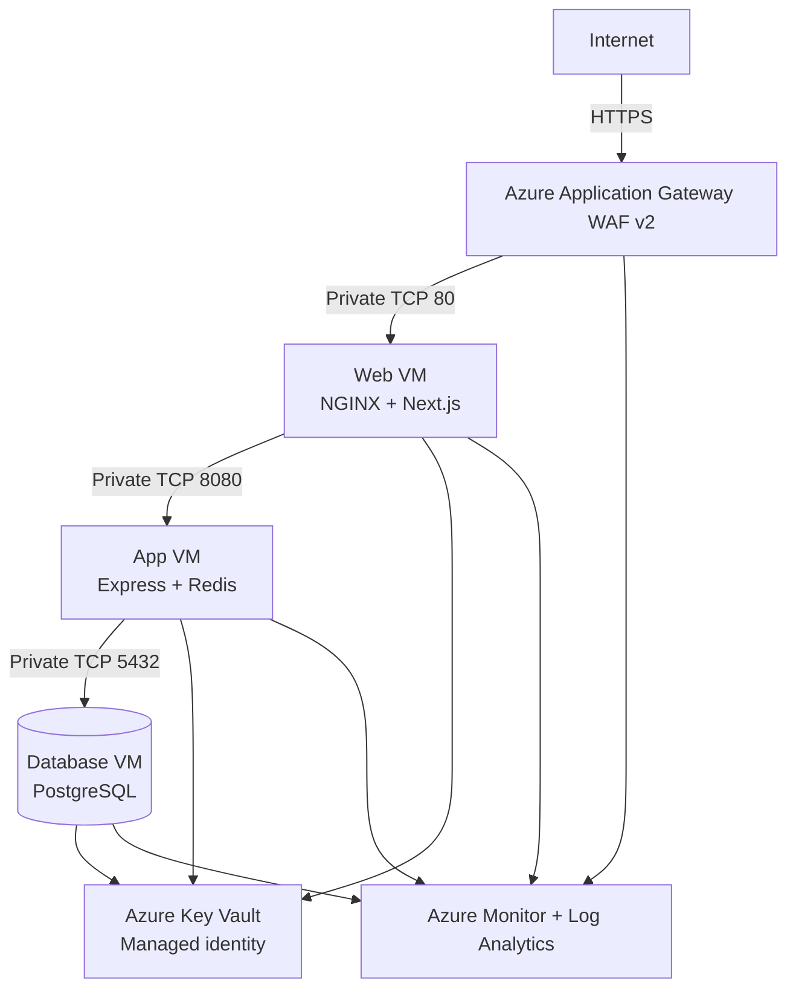

# RouteWell Enterprise MVP

RouteWell is a portfolio-grade logistics and route management platform for delivery companies. It combines a responsive operations dashboard, a secure REST API, PostgreSQL, Redis, containerized local development, a three-tier Microsoft Azure design, Terraform, GitHub Actions, monitoring, testing and failure runbooks.

> This is a fresh implementation. It does not contain the failed build artifacts, backup source folders, npm logs or partial patches from the earlier RouteWell package.

## Product capabilities

### Operations users

- Register and sign in.
- Manage profile information.
- Create and search deliveries.
- Assign or remove drivers, vehicles and reusable routes.
- Track deliveries through a controlled state machine and immutable event history.
- Manage customers, drivers, vehicles and routes.
- View dashboard metrics and export delivery reports.
- Read and acknowledge notifications.

### Administrators

- List users and search accounts.
- Assign roles and suspend access.
- Prevent accidental self-lockout.
- Revoke active refresh sessions when an account is suspended.
- View application, PostgreSQL and Redis health information.

## Technology stack

| Layer | Technology |
|---|---|
| Frontend | Next.js App Router, React, TypeScript, Tailwind CSS, shadcn-style components, TanStack Query, Axios, React Hook Form, Zod, Recharts, Framer Motion |
| Backend | Node.js, Express, TypeScript, REST, JWT, rotating refresh sessions, RBAC, Swagger UI, Winston, Helmet, CORS, rate limits, Zod |
| Data | PostgreSQL, Prisma ORM, Redis |
| Local platform | Docker, Docker Compose, NGINX, Prometheus, Grafana |
| Cloud | Azure Linux VMs, VNet, NSGs, Application Gateway WAF v2, Key Vault, Bastion option, Azure Monitor, Log Analytics |
| Delivery | GitHub Actions, GHCR, Azure OIDC, VM Run Command, optional private-SSH workflow, Terraform, Bash |

## Architecture



The VMs have private addresses only. Application Gateway is the public entry point. The database tier accepts PostgreSQL traffic only from the app subnet, and the web tier cannot connect directly to PostgreSQL.

## Repository layout

```text
RouteWell-Enterprise-MVP/
├── frontend/                     # Next.js UI, same-origin API proxy and tests
├── backend/                      # Express API, services, repositories and tests
├── database/
│   ├── prisma/                   # Canonical schema and executable migrations
│   ├── migrations/               # Reviewed SQL mirror / DBA records
│   └── seed/                     # Seed execution instructions
├── infrastructure/
│   ├── terraform/                # Azure infrastructure as code
│   ├── bash/                     # Environment, validation and deployment scripts
│   ├── docker/                   # Tier-specific production Compose files
│   ├── nginx/                    # Local and production reverse proxies
│   ├── monitoring/               # Prometheus and provisioned Grafana dashboard
│   └── diagrams/                 # Mermaid architecture sources
├── .github/workflows/            # CI, CD, private SSH and security workflows
├── docs/                         # Architecture, security, deployment and runbooks
├── docker-compose.yml            # Complete local application
├── .env.example
└── README.md
```

# Local quick start

## Prerequisites

- Docker Desktop or Docker Engine with Compose v2.
- Git.
- OpenSSL, included with macOS and most Linux distributions.
- Node.js 24 for direct, non-Docker development.

## 1. Enter the fresh folder

```bash
cd RouteWell-Enterprise-MVP
```

## 2. Generate the local environment

```bash
make init
```

This writes a mode-`600` `.env` with random PostgreSQL, JWT and Grafana secrets. It never overwrites an existing `.env`.

## 3. Generate dependency lockfiles

```bash
make lock
```

This uses the same Node image as the Dockerfiles and creates:

```text
backend/package-lock.json
frontend/package-lock.json
```

Commit both lockfiles after the first trusted dependency resolution. Docker automatically uses `npm ci` when they exist and uses a retry-aware first-install path when they do not.

## 4. Build each image separately

```bash
docker compose --progress=plain build frontend
docker compose --progress=plain build backend
```

Separate builds make registry, frontend and backend failures easy to identify and preserve successful BuildKit cache layers.

## 5. Start the stack

```bash
docker compose up -d
docker compose ps
```

## 6. Seed demonstration data

```bash
make seed
```

Local accounts use the values in `.env`:

```text
Administrator: admin@routewell.local
Driver:        driver@routewell.local
```

The generated `.env` initially uses `RouteWellAdmin123!` and `RouteWellDriver123!` for the local demo. Change them before seeding a shared environment.

## 7. Verify

```bash
curl -i http://localhost/healthz
curl -i http://localhost/api/health
./infrastructure/bash/health-check.sh http://localhost
```

Open:

- Application: `http://localhost`
- Swagger UI: `http://localhost/api-docs`
- OpenAPI JSON: `http://localhost/api-docs.json`

Optional monitoring:

```bash
make monitoring
```

- Prometheus: `http://127.0.0.1:9090`
- Grafana: `http://127.0.0.1:3001`

## Common local commands

```bash
make logs             # Follow service logs
make down             # Stop containers and preserve volumes
make reset            # Destructive: stop containers and remove volumes
make seed             # Repeatable seed
make validate         # Dependency-free repository validation
make validate-full    # Install, lint, test, build, Compose and Terraform checks
```

# Phase-by-phase implementation

## Phase 1 — Requirements and planning

The MVP actors, user stories, functional and non-functional requirements are documented in [`docs/architecture/requirements.md`](docs/architecture/requirements.md).

## Phase 2 — System design

High-level, low-level, authentication, delivery state and trust-boundary designs are in [`docs/architecture/system-design.md`](docs/architecture/system-design.md).

### CIDR plan

| Subnet | CIDR | Purpose |
|---|---:|---|
| Application Gateway | `10.10.0.0/24` | Dedicated WAF v2 subnet and scaling headroom |
| Web | `10.10.1.0/27` | NGINX and Next.js |
| App | `10.10.2.0/27` | Express and Redis |
| Database | `10.10.3.0/28` | PostgreSQL |
| Bastion | `10.10.5.0/26` | Optional private administration |

## Phase 3 — Backend

The API uses routes → controllers → services → repositories → Prisma. Implemented cross-cutting controls include:

- Short-lived access tokens and hashed rotating refresh sessions.
- HTTP-only cookies and double-submit CSRF protection.
- Immediate database revalidation of role and account status.
- RBAC for admin, manager, dispatcher, driver and viewer roles.
- Zod validation for body, query and route parameters.
- Delivery state-machine enforcement and immutable delivery events.
- Audit records, structured logs and request IDs.
- Liveness, readiness, Prometheus metrics and Swagger UI.
- Normalized validation, conflict, not-found and malformed-JSON errors.

Direct development:

```bash
cp backend/.env.example backend/.env
npm --prefix backend install
npm --prefix backend run prisma:generate
npm --prefix backend run dev
```

## Phase 4 — Database

The canonical model is [`database/prisma/schema.prisma`](database/prisma/schema.prisma). Executable migrations are beside the schema under `database/prisma/migrations` so `prisma migrate deploy` works in containers and CI.

```bash
npm --prefix backend run prisma:migrate:dev -- --name describe_change
npm --prefix backend run prisma:migrate:deploy
npm --prefix backend run prisma:seed
```

The backend container applies committed migrations before starting the API. It never uses `prisma db push` or `migrate reset` in production.

## Phase 5 — Frontend

Implemented pages include landing, register, login, operations dashboard, deliveries, customers, drivers, vehicles, routes, reports, notifications, profile, user administration and system monitoring. The dashboard has responsive desktop/mobile navigation, dark mode, loading states, API errors and charts.

The browser calls same-origin `/api/v1`. A hardened Next.js route handler forwards requests to `BACKEND_INTERNAL_URL`, preserving the private backend boundary and forwarding secure cookies.

## Phase 6 — Docker and NGINX

- Multi-stage frontend and backend images.
- Non-root runtime users.
- Read-only filesystems and explicit temporary mounts.
- `no-new-privileges` on application services.
- SCRAM PostgreSQL authentication.
- Isolated web, app and internal data networks.
- Lockfile-aware npm installation with BuildKit cache and retry settings.
- NGINX reverse proxy, JSON access logs and an additional API rate limit.

See [`docs/deployment/docker-guide.md`](docs/deployment/docker-guide.md).

## Phase 7 — Git workflow

Use protected `main` and `develop` branches with feature branches and pull requests. See [`docs/BRANCHING.md`](docs/BRANCHING.md).

## Phase 8 — Azure network and resources

Terraform creates the resource group, VNet, dedicated gateway subnet, private web/app/database subnets, tier NSGs, private NICs, Linux VMs, optional Bastion, Application Gateway WAF v2, Key Vault, managed identities, Azure Monitor Agent and Log Analytics.

The Terraform NSGs explicitly deny all other lateral VNet traffic after the narrow allow rules. This prevents default VNet rules from unintentionally allowing web-to-database or unrelated tier traffic.

## Phase 9 — VM software installation

Cloud-init and [`infrastructure/bash/bootstrap-vm.sh`](infrastructure/bash/bootstrap-vm.sh) install Git, Docker Engine, Compose, Azure CLI, journald logging and host hardening settings.

## Phase 10 — Terraform deployment

```bash
cd infrastructure/terraform
cp terraform.tfvars.example terraform.tfvars
terraform fmt -recursive
terraform init
terraform validate
terraform plan -out routewell.tfplan
terraform apply routewell.tfplan
```

Use remote Azure Blob state for team or production use. See [`docs/deployment/terraform-guide.md`](docs/deployment/terraform-guide.md).

## Phase 11 — Bash automation

[`infrastructure/bash/deploy.sh`](infrastructure/bash/deploy.sh) applies Terraform, resolves outputs, and deploys database → app → web through Azure VM Run Command. [`deploy-tier.sh`](infrastructure/bash/deploy-tier.sh) retrieves secrets through each VM's managed identity, pulls immutable image tags and waits for container health.

## Phase 12 — CI/CD

- `ci.yml`: Prisma generation, lint, tests, builds, Terraform validation and Docker image builds.
- `cd.yml`: GHCR publication, SBOM/provenance, Azure OIDC, Key Vault updates, private-tier deployment and public health check.
- `cd-ssh.yml`: optional deployment from a hardened self-hosted runner inside the VNet.
- `security.yml`: CodeQL and Trivy scanning.

See [`docs/deployment/cicd-guide.md`](docs/deployment/cicd-guide.md).

## Phase 13 — Monitoring and logging

- JSON application and NGINX logs.
- Prometheus default/process and HTTP metrics.
- Provisioned Grafana datasource and RouteWell dashboard.
- Azure Monitor Agent and Data Collection Rule on all VMs.
- Log Analytics, Application Gateway diagnostics and CPU alerts.
- Container logs through journald in the production tier.

## Phase 14 — Security

Implemented controls include Helmet, CSP, password hashing, cookie-based JWT, refresh rotation, CSRF, CORS, rate limiting, Zod validation, Prisma parameterization, RBAC, audit logs, Key Vault, managed identities, secret files, WAF, private VMs, private database access, non-root containers, CodeQL and Trivy.

Public registration is enabled for the local demonstration and explicitly disabled by the production app Compose file. See [`docs/security/security.md`](docs/security/security.md).

## Phase 15 — Failure simulation

The failure runbook covers blocked port `8080`, removed app-to-database access, an incorrect database host and a stopped PostgreSQL container. Every exercise includes symptoms, investigation, root cause, fix and lesson. See [`docs/troubleshooting/failure-simulations.md`](docs/troubleshooting/failure-simulations.md).

## Phase 16 — Final verification and portfolio presentation

```bash
make validate
make validate-full
```

Use [`docs/demo/DEMO_SCRIPT.md`](docs/demo/DEMO_SCRIPT.md) for a recorded walkthrough and [`docs/PORTFOLIO.md`](docs/PORTFOLIO.md) for interview talking points. Screenshot guidance is in [`docs/screenshots/README.md`](docs/screenshots/README.md).

## Documentation index

- [Requirements](docs/architecture/requirements.md)
- [System design](docs/architecture/system-design.md)
- [API guide](docs/api/API.md)
- [Docker guide](docs/deployment/docker-guide.md)
- [Azure guide](docs/deployment/azure-guide.md)
- [Terraform guide](docs/deployment/terraform-guide.md)
- [CI/CD guide](docs/deployment/cicd-guide.md)
- [End-to-end deployment](docs/deployment/deployment-guide.md)
- [Security](docs/security/security.md)
- [Testing](docs/TESTING.md)
- [Validation record](docs/VALIDATION.md)
- [Captured static validation](docs/STATIC_VALIDATION.txt)
- [Troubleshooting](docs/troubleshooting/troubleshooting-guide.md)
- [Failure simulations](docs/troubleshooting/failure-simulations.md)
- [Demo script](docs/demo/DEMO_SCRIPT.md)
- [Portfolio presentation](docs/PORTFOLIO.md)

## Production boundary

This repository is a complete portfolio MVP and deployment reference. Before handling real customer data, add organization-owned DNS/TLS, enterprise identity/MFA, email verification and recovery, a legal/privacy review, load and penetration testing, tested off-host backup restoration, and a production cost/availability decision. A managed PostgreSQL service is preferable for most commercial workloads even though the VM database here intentionally demonstrates subnet and host-level DevOps skills.

## License

MIT. See [`LICENSE`](LICENSE).
