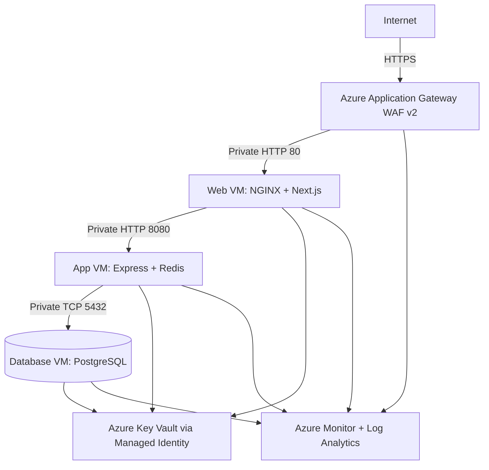

# RouteWell

**Enterprise logistics, delivery, fleet and route management platform** built as a portfolio-grade full-stack, cloud, DevOps and security project.

RouteWell combines a Next.js web application, an Express/TypeScript API, PostgreSQL, Prisma, Redis, Docker, NGINX, Terraform, GitHub Actions and a secure three-tier Microsoft Azure network.

## What the project demonstrates

- Full-stack product design and responsive dashboard development.
- REST API architecture, repository/service layers, validation and testing.
- JWT access tokens, refresh-token rotation, RBAC, CSRF and audit logging.
- PostgreSQL relational modelling and production migration workflow.
- Docker hardening, multi-stage images, Compose and reverse proxying.
- Azure VNet, subnets, NSGs, private VMs, Application Gateway WAF, Key Vault, Azure Monitor and Log Analytics.
- Infrastructure as Code, CI/CD, security scanning, deployment health checks and failure runbooks.

## Architecture



The database has no public IP. The web subnet cannot reach PostgreSQL. Browser API traffic stays on the public web origin and is proxied by Next.js to the private app tier.

## Repository structure

```text
routewell/
├── frontend/                    # Next.js App Router UI and API proxy
├── backend/                     # Express REST API, tests and Docker image
├── database/
│   ├── prisma/                  # Schema and executable migrations
│   ├── migrations/              # DBA review/export location
│   └── seed/                    # Local portfolio seed
├── infrastructure/
│   ├── terraform/               # Azure IaC
│   ├── bash/                    # Bootstrap, deploy, health and backup scripts
│   ├── docker/                  # Tier-specific production Compose files
│   ├── nginx/                   # Reverse proxy configuration
│   ├── monitoring/              # Prometheus and Grafana local setup
│   └── diagrams/                # Mermaid source diagrams
├── .github/workflows/           # CI, CD, SSH CD and security workflows
├── docs/                        # Architecture, deployment, API, security and runbooks
├── docker-compose.yml           # Complete local environment
├── .env.example
└── README.md
```

## Technology stack

### Frontend

Next.js App Router, React, TypeScript, Tailwind CSS, shadcn-style reusable components, TanStack Query, Axios, React Hook Form, Zod, Recharts, Framer Motion and dark mode.

### Backend

Node.js, Express, TypeScript, Prisma, PostgreSQL, Redis, JWT, rotating refresh sessions, RBAC, Zod, Helmet, CORS, rate limiting, Winston, Prometheus metrics and Swagger UI.

### Platform

Docker, Docker Compose, NGINX, GitHub Actions, GHCR, Terraform, Bash, Azure CLI, Azure Linux VMs, VNet, NSGs, Application Gateway WAF v2, Key Vault, Azure Monitor and Log Analytics.

## Phase 1 — Planning

Detailed requirements, actors, MVP, non-functional requirements and user stories are in [`docs/architecture/requirements.md`](docs/architecture/requirements.md).

Core MVP:

1. Authentication and role-based authorization.
2. Customer, driver, vehicle and route management.
3. Delivery creation, assignment, search and status tracking.
4. Dashboard and reports.
5. Audit, logging, metrics and health checks.
6. Containerized local and Azure deployment.

## Phase 2 — System design

See [`docs/architecture/system-design.md`](docs/architecture/system-design.md) for high-level, low-level, authentication, state-machine and network diagrams.

### CIDR plan

| Tier | CIDR |
|---|---:|
| Application Gateway | `10.10.0.0/24` |
| Web | `10.10.1.0/27` |
| App | `10.10.2.0/27` |
| Database | `10.10.3.0/28` |
| Bastion | `10.10.5.0/26` |

The dedicated gateway subnet was added because Application Gateway must run in its own subnet and needs scaling headroom.

## Phase 3 — Local initialization

### Prerequisites

- Node.js 24 LTS recommended.
- Docker Engine with Compose v2.
- Git.
- Terraform 1.15.x and Azure CLI for cloud deployment.

### Start the complete local environment

```bash
git clone <your-routewell-repository>
cd routewell
cp .env.example .env
docker compose up --build -d
docker compose exec backend npm run prisma:seed:prod
```

Verify:

```bash
docker compose ps
curl http://localhost/healthz
curl http://localhost/api/health
```

Open `http://localhost`.

Local demo account:

```text
Email:    admin@routewell.local
Password: RouteWellAdmin123!
```

Change or remove that seed before a shared environment.

## Phase 4 — Backend

The backend uses layered controllers, services and repositories under `backend/src`.

Implemented modules:

- Authentication: register, login, refresh rotation, logout and editable current-user profile.
- Users: administrator list and role/access update endpoint.
- Customers, drivers, vehicles and routes: validated CRUD.
- Deliveries: create, search, update, delete and controlled status transitions.
- Dashboard: cached operational summary and administrator dependency monitoring.
- Reports: delivery grouping and export-friendly JSON.
- Notifications: delivery event notifications with individual and bulk read state.
- Cross-cutting: RBAC, CSRF, audit logs, request IDs, JSON logs, health, metrics and error normalization.

Direct development:

```bash
cp backend/.env.example backend/.env
npm --prefix backend install
npm --prefix backend run prisma:generate
npm --prefix backend run dev
```

Tests:

```bash
npm --prefix backend test
npm --prefix backend run lint
npm --prefix backend run build
```

## Phase 5 — Database

Canonical schema: `database/prisma/schema.prisma`.

Development migration:

```bash
npm --prefix backend run prisma:migrate:dev -- --name describe_change
```

Production migration:

```bash
npm --prefix backend run prisma:migrate:deploy
```

Seed:

```bash
npm --prefix backend run prisma:seed
```

Production startup runs `prisma migrate deploy` before starting the API. Never use `migrate reset` in production.

## Phase 6 — Frontend

Implemented pages:

- Landing page.
- Register and login.
- Operations dashboard and charts.
- Deliveries and create-delivery flow.
- Customers, drivers, vehicles and routes.
- Reports and export.
- Admin users and system monitoring.
- Notifications and editable profile.
- Dark mode, mobile navigation, loading and error states.

Direct development:

```bash
cp frontend/.env.example frontend/.env.local
npm --prefix frontend install
npm --prefix frontend run dev
```

The browser calls same-origin `/api/v1`. The Next.js route handler forwards requests to `BACKEND_INTERNAL_URL`, preserving the private app tier.

## Phase 7 — Docker and NGINX

The root Compose file runs PostgreSQL, Redis, backend, frontend, NGINX, Prometheus and Grafana. Production separates the web, app and DB tiers under `infrastructure/docker/`.

```bash
docker compose config
docker compose logs -f backend
docker compose down
docker compose down -v  # removes local data
```

See [`docs/deployment/docker-guide.md`](docs/deployment/docker-guide.md).

## Phase 8 — Git and collaboration

Recommended flow:

```text
main <- release PR <- develop <- feature/RW-123-description
```

Protect `main` and require CI, security checks, review and production environment approval. See [`docs/BRANCHING.md`](docs/BRANCHING.md).

## Phase 9 — Azure manual lab

For a learning exercise:

```bash
LOCATION=westeurope RG=rg-routewell-lab \
  infrastructure/bash/azure-manual-lab.sh
```

This creates the core private network and VMs. Terraform remains the production source of truth.

## Phase 10 — Terraform

```bash
cd infrastructure/terraform
cp terraform.tfvars.example terraform.tfvars
terraform fmt -recursive
terraform init
terraform validate
terraform plan -out routewell.tfplan
terraform apply routewell.tfplan
```

Resources include the resource group, VNet, subnets, NSGs, NICs, VMs, Application Gateway WAF, public IP, optional Bastion, Key Vault, managed identities, Log Analytics, Azure Monitor Agent, DCR, diagnostics and alerts.

See [`docs/deployment/terraform-guide.md`](docs/deployment/terraform-guide.md).

## Phase 11 — Bash automation

`infrastructure/bash/deploy.sh` provisions Terraform and deploys all tiers using Azure VM Run Command.

```bash
export TF_VAR_admin_ssh_public_key="$(cat ~/.ssh/id_ed25519.pub)"
export REPO_URL="https://github.com/your-account/routewell.git"
export IMAGE_PREFIX="ghcr.io/your-account/routewell"
infrastructure/bash/deploy.sh
```

Supporting scripts:

- `bootstrap-vm.sh`
- `deploy-tier.sh`
- `health-check.sh`
- `backup-db.sh`
- `azure-manual-lab.sh`

## Phase 12 — CI/CD

- `ci.yml`: lint, test, build, Prisma generation, Terraform validation and Docker builds.
- `cd.yml`: publish images, Azure OIDC, Key Vault update, VM Run Command deployment and health check.
- `cd-ssh.yml`: optional SSH deployment from a self-hosted runner inside the VNet.
- `security.yml`: CodeQL and Trivy.

See [`docs/deployment/cicd-guide.md`](docs/deployment/cicd-guide.md).

Validation scope and the exact checks that still require a dependency-enabled environment are recorded in [`docs/VALIDATION.md`](docs/VALIDATION.md).

## Phase 13 — Monitoring and logging

Local:

- Prometheus: `127.0.0.1:9090`
- Grafana: `127.0.0.1:3001`
- Backend metrics: `/metrics`
- Health: `/health/live`, `/health/ready`

Azure:

- Azure Monitor Agent on all VMs.
- DCR for performance and syslog.
- Application Gateway diagnostics.
- Log Analytics workspace.
- CPU alerts and action group.
- Container logs sent to journald.

## Phase 14 — Security

Implemented:

- Helmet and secure headers.
- Same-origin HTTPS-ready cookies.
- JWT access and rotating refresh tokens.
- Password hashing.
- CSRF double-submit protection.
- RBAC and least privilege.
- CORS, rate limiting and Zod validation.
- Prisma SQL injection protection.
- Key Vault, managed identity and Docker secret files.
- Private database and tier-specific NSGs.
- Non-root, read-only containers.
- CodeQL, Trivy, SBOM and provenance.

See [`docs/security/security.md`](docs/security/security.md).

## Phase 15 — Failure simulations

Runbooks cover:

1. Blocking backend port 8080.
2. Removing app-to-database access.
3. Misconfiguring the database host.
4. Stopping PostgreSQL.

Each contains symptoms, root cause, investigation, fix and lesson. See [`docs/troubleshooting/failure-simulations.md`](docs/troubleshooting/failure-simulations.md).

## Phase 16 — Final verification

```bash
npm --prefix backend run lint
npm --prefix backend test
npm --prefix backend run build
npm --prefix frontend run lint
npm --prefix frontend test
npm --prefix frontend run build
terraform -chdir=infrastructure/terraform fmt -check -recursive
terraform -chdir=infrastructure/terraform validate
docker compose config
```

Final documentation:

- [Requirements](docs/architecture/requirements.md)
- [System design](docs/architecture/system-design.md)
- [API](docs/api/API.md)
- [Deployment](docs/deployment/deployment-guide.md)
- [Docker](docs/deployment/docker-guide.md)
- [Terraform](docs/deployment/terraform-guide.md)
- [Azure](docs/deployment/azure-guide.md)
- [CI/CD](docs/deployment/cicd-guide.md)
- [Security](docs/security/security.md)
- [Troubleshooting](docs/troubleshooting/troubleshooting-guide.md)
- [Failure simulations](docs/troubleshooting/failure-simulations.md)
- [Testing](docs/TESTING.md)
- [Interview presentation](docs/PORTFOLIO.md)

## Important production notes

This repository is a strong, deployable reference implementation. A real commercial launch still requires organization-specific domain/TLS material, Azure subscription identifiers, GitHub environment secrets, legal/privacy review, tested backup restoration, performance testing, external penetration testing and a cost/availability decision. For commercial workloads, consider Azure Database for PostgreSQL Flexible Server and a managed container platform instead of self-managed database/application VMs.

## Official learning references

- Next.js installation and App Router: `https://nextjs.org/docs/app/getting-started/installation`
- Next.js deployment: `https://nextjs.org/docs/app/getting-started/deploying`
- Prisma production migrations: `https://www.prisma.io/docs/orm/prisma-migrate/workflows/development-and-production`
- Azure Application Gateway: `https://learn.microsoft.com/azure/application-gateway/`
- Azure Monitor VM monitoring: `https://learn.microsoft.com/azure/azure-monitor/vm/vm-enable-monitoring`
- GitHub Actions secure use: `https://docs.github.com/actions/reference/security/secure-use`
- GitHub Container Registry: `https://docs.github.com/packages/working-with-a-github-packages-registry/working-with-the-container-registry`
- Terraform AzureRM provider: `https://registry.terraform.io/providers/hashicorp/azurerm/latest/docs`

## License

MIT — see [`LICENSE`](LICENSE).
