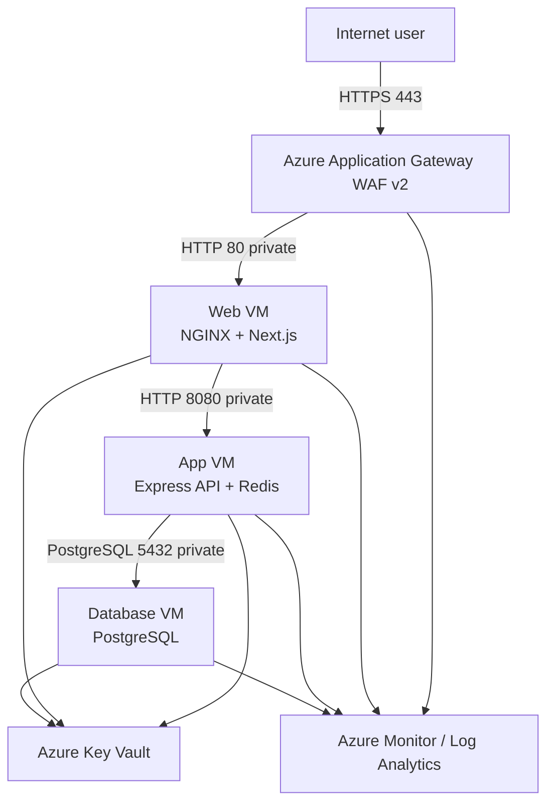
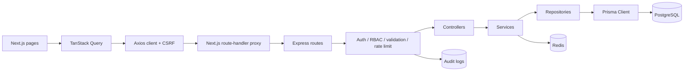
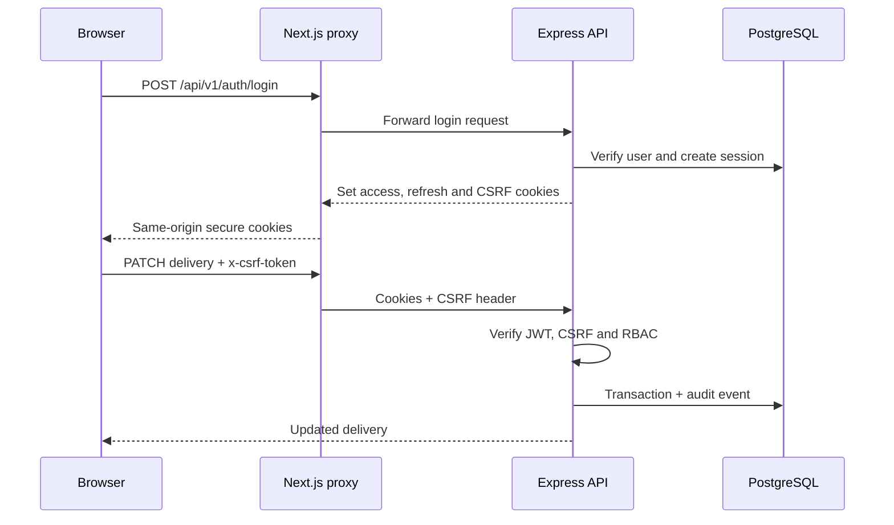

# System design

## High-level architecture

The browser uses one public origin. Next.js proxies `/api/v1/*` server-side to the private app VM, so the backend is never directly exposed to the browser or Internet.

## Low-level application design

## Network plan

| Subnet | CIDR | Usable purpose |
|---|---:|---|
| Application Gateway | `10.10.0.0/24` | Dedicated gateway instances and autoscaling headroom |
| Web | `10.10.1.0/27` | Private frontend VMs or future scale set |
| App | `10.10.2.0/27` | Private API VMs or future scale set |
| Database | `10.10.3.0/28` | PostgreSQL primary/replica and database tooling |
| Azure Bastion | `10.10.5.0/26` | Optional secure administrative SSH access |
| Reserved | Remaining `10.10.0.0/16` | Private endpoints, management, DR and future services |

Azure reserves five addresses in every subnet. Application Gateway receives a dedicated `/24` because gateway instances consume private addresses and require room for scaling.

## Trust boundaries

1. Internet traffic terminates at Application Gateway WAF.
2. Only the gateway subnet can reach web port 80.
3. Only the web subnet can reach app port 8080.
4. Only the app subnet can reach database port 5432.
5. Administrative SSH is private and originates from Azure Bastion or a self-hosted runner inside the VNet.
6. VM managed identities read runtime secrets from Key Vault.

## Authentication sequence

## Delivery state machine

`PENDING → ASSIGNED → PICKED_UP → IN_TRANSIT → DELIVERED`

Failure branches allow `FAILED`, reassignment, or `CANCELLED` where defined in `DeliveryService`. Invalid transitions return HTTP `409`.

## Scale-out path

The current VM design intentionally demonstrates networking and host operations. A production evolution can replace web/app VMs with VM Scale Sets, Azure Container Apps or AKS; replace the database VM with Azure Database for PostgreSQL Flexible Server; add Azure Cache for Redis; and deploy across availability zones.
